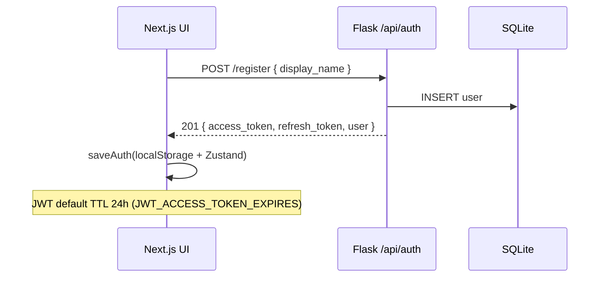
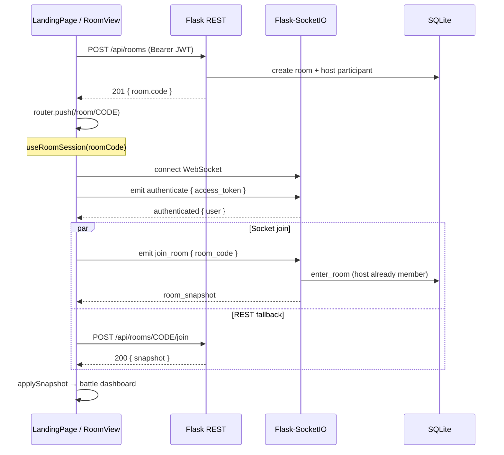
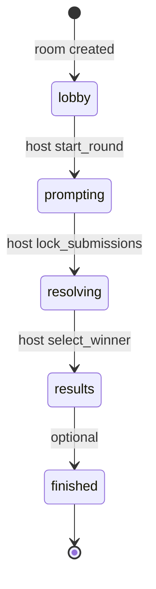
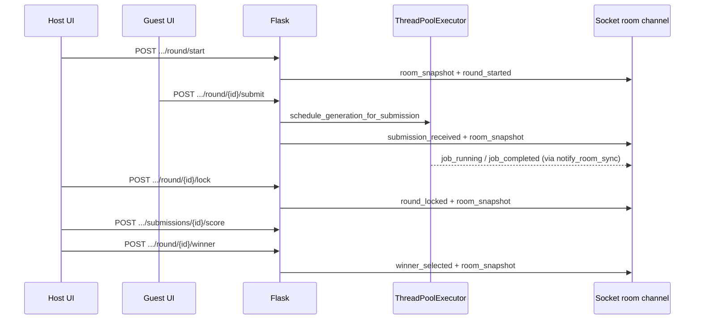
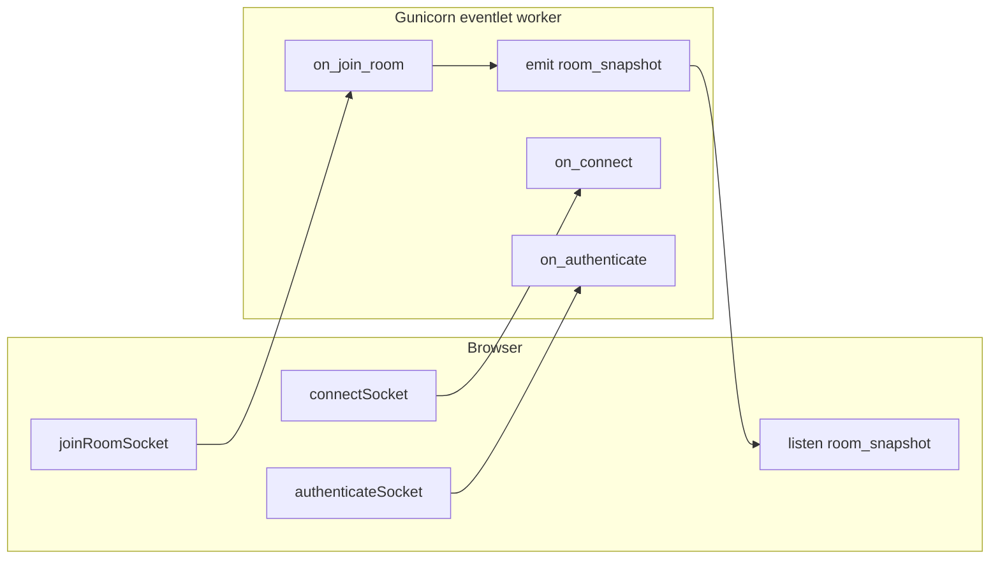
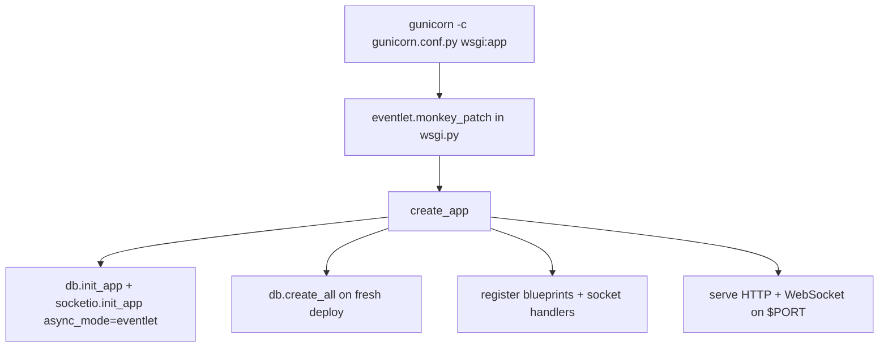

# PromptArena — AI Creative Battle Room

**Poiro Full-Stack Developer Intern Assignment**

A minimal realtime multiplayer battle room: one host runs the challenge, participants submit prompts, the backend runs async AI generation jobs, and the host scores and selects a winner. Built as a focused vertical slice (one room, one round) with backend-enforced roles and Socket.IO live updates.

---

## Demo flow (quick start)

| Step | Action |
|------|--------|
| 1 | Start API: `cd backend && python run.py` (or `.\start.ps1`) |
| 2 | Start UI: `cd frontend && npm run dev` (or `.\start.ps1`) |
| 3 | Open http://localhost:3000 in **two** browser windows |
| 4 | Window A: name **Host** → **Create room** → copy 6-letter code |
| 5 | Window B: name **Guest** → **Join room** with code |
| 6 | Host: **Start round** (edit theme if desired) |
| 7 | Guest: **Submit prompt** → watch job states (queued → running → completed) |
| 8 | Host: **Lock submissions** → score 1–10 (optional) → **Select winner** on a campaign card |
| 9 | Refresh either window — room, submissions, scores, and winner remain (SQLite + JWT) |

**Automated check:** from `backend/`: `python -m pytest tests/ -v`

**Demo helper:** `flask seed-demo` (prints the steps above)

---

## Local setup

### Prerequisites

- Python 3.11+ (3.12 recommended for production parity)
- Node.js 20+
- npm

### 1. Backend

```bash
cd backend
python -m venv .venv
.venv\Scripts\activate          # macOS/Linux: source .venv/bin/activate

pip install -r requirements.txt
copy .env.example .env          # macOS/Linux: cp .env.example .env

python run.py
```

API: http://localhost:5000  
Health: http://localhost:5000/api/health

Tables are created automatically on startup (`create_app()` → `db.create_all()`). `flask --app app:create_app init-db` is optional for manual setup.

### 2. Frontend

```bash
cd frontend
npm install
copy .env.local.example .env.local   # macOS/Linux: cp .env.local.example .env.local

npm run dev
```

UI: http://localhost:3000

### Environment variables

| File | Purpose |
|------|---------|
| `backend/.env.example` | Flask, SQLite, JWT, CORS, Socket.IO, mock AI tuning |
| `frontend/.env.local.example` | `NEXT_PUBLIC_API_URL` (default `http://localhost:5000`) |

**Required locally:** `CORS_ORIGINS` on the backend must include `http://localhost:3000`.

---

## Production deployment

### Backend — Render

| Setting | Value |
|---------|--------|
| **Root directory** | `backend` |
| **Build command** | `pip install -r requirements.txt` |
| **Start command** | `gunicorn -c gunicorn.conf.py wsgi:app` |

**Environment variables:**

| Variable | Example / notes |
|----------|-----------------|
| `FLASK_ENV` | `production` |
| `SOCKETIO_ASYNC_MODE` | `eventlet` |
| `PYTHON_VERSION` | `3.12.7` |
| `SECRET_KEY` | Strong random string |
| `JWT_SECRET_KEY` | Strong random string |
| `DATABASE_URL` | `sqlite:///instance/promptarena.db` |
| `CORS_ORIGINS` | `https://your-app.vercel.app` |

**Socket.IO on Gunicorn:** WebSockets require the **eventlet** worker (`gunicorn.conf.py`). The default **sync** worker only serves HTTP — room join will time out even if the WebSocket handshake returns 101. This repo pins `gunicorn>=25.2,<26` because **Gunicorn 26 removed the eventlet worker**.

After deploy, logs should show:

```text
Using worker: eventlet
Flask-SocketIO initialized async_mode=eventlet
```

A blueprint is in `backend/render.yaml` for reference.

### Frontend — Vercel

| Setting | Value |
|---------|--------|
| **Root directory** | `frontend` |
| **Build command** | `npm run build` |
| **Environment variable** | `NEXT_PUBLIC_API_URL=https://your-render-service.onrender.com` (no trailing slash) |

Redeploy after changing env vars.

### Production caveats

- Render free-tier SQLite is **ephemeral** — data is lost on redeploy unless you attach persistent disk or switch to Postgres.
- Run **one Gunicorn worker** (`-w 1`) unless you add `SOCKETIO_MESSAGE_QUEUE` (Redis) for multi-process Socket.IO.

---

## System architecture

```
┌─────────────────────────────────────────────────────────────────────────┐
│                         Vercel (Next.js 16)                              │
│  LandingPage ──► /room/[code] ──► Zustand (auth, socket, room)          │
│       │                    │                                             │
│       │ REST (JWT Bearer)  │ Socket.IO (WebSocket)                       │
└───────┼────────────────────┼─────────────────────────────────────────────┘
        │                    │
        ▼                    ▼
┌─────────────────────────────────────────────────────────────────────────┐
│                    Render (Gunicorn + eventlet worker)                   │
│  wsgi.py ──► create_app() ──► Blueprints (REST) + Socket handlers        │
│                    │                                                     │
│         ┌──────────┼──────────┐                                         │
│         ▼          ▼          ▼                                         │
│    Services   SnapshotService  ThreadPoolExecutor (mock AI jobs)         │
│         │          │                                                     │
│         └──────────┼──────────► SQLAlchemy ──► SQLite                    │
└────────────────────┴────────────────────────────────────────────────────┘
```

| Layer | Technology | Role |
|-------|------------|------|
| **Frontend** | Next.js App Router, TypeScript, Tailwind, Zustand | UI, client state, REST + Socket.IO client |
| **API** | Flask blueprints (`/api/auth`, `/api/rooms`, `/api/health`) | JWT auth, room CRUD, round actions |
| **Realtime** | Flask-SocketIO (`async_mode=eventlet`) | Live snapshots, activity, job status |
| **Domain** | Service layer (`RoomService`, `RoundService`, …) | Business rules, permissions |
| **Persistence** | SQLAlchemy + SQLite | Users, rooms, rounds, submissions, jobs |
| **AI** | `MockAIProvider` + `ThreadPoolExecutor` | Async campaign generation (swappable) |

Deeper design notes: [`docs/ARCHITECTURE.md`](docs/ARCHITECTURE.md)

---

## Technical flows & workflows

### 1. Authentication (guest JWT)



On page load, `authStore.hydrate()` calls `GET /api/auth/me` with the stored token. Expired tokens redirect to landing with a session-expired message.

### 2. Room creation & join (host path)



**Authoritative state:** `room_snapshot` (Socket.IO) and REST snapshot responses share the same `SnapshotService.build()` output. The frontend polls the Zustand store for up to 6s; REST join-by-code runs in parallel so the room loads even if socket events are delayed.

### 3. Battle round lifecycle





Submissions close only when the host **locks** — there is no server-side prompt deadline timer.

### 4. Socket.IO connection model



| Step | Client | Server handler | Event |
|------|--------|----------------|-------|
| 1 | `io(API_BASE)` | `on_connect` | `connected` |
| 2 | `emit authenticate` | `on_authenticate` | `authenticated` |
| 3 | `emit join_room` | `on_join_room` | `room_snapshot` (+ `room_reconnected` if returning member) |
| 4 | `on('room_snapshot')` | `notify_room_sync` on state changes | broadcast to `room:{id}` |

In-memory map `_connected_users[sid] → user_id` is **ephemeral** (lost on restart). DB holds room membership; reconnect re-authenticates and re-joins.

### 5. Backend startup (production)



---

## Database schema (entity model)

SQLite via SQLAlchemy. Integer PKs, UTC timestamps. Tables are auto-created on app startup.

| Entity | Purpose |
|--------|---------|
| **User** | Guest identity (`display_name`); JWT identifies user across refreshes |
| **Room** | `code`, `host_user_id`, `status`, `current_round_id`, `max_players` |
| **Participant** | `room_id`, `user_id`, `role` (host/player), `connection_status`, soft `left_at` |
| **Round** | `room_id`, `round_number`, `status`, `battle_theme`, `winner_user_id` |
| **Submission** | One per user per round; `prompt_text`, `status`, `ai_output` (JSON campaign), `score` |
| **GenerationJob** | One per submission; `status`, `retry_count`, timestamps, `error_message` |
| **ActivityEvent** | Append-only feed (`event_type`, JSON `payload`) |

**Relationships:** Room → many Participants, Rounds, ActivityEvents. Round → many Submissions, one active GenerationJob per submission. Room.`current_round_id` points at the live round during battle.

---

## Room & round state machines

### Room (`lobby` → `prompting` → `resolving` → `results` → `finished`)

| Phase | Meaning |
|-------|---------|
| `lobby` | Waiting; host can start round (≥2 members) |
| `prompting` | Participants submit one prompt each; host locks when ready |
| `resolving` | Submissions locked; generations finish; host judges |
| `results` | Winner selected; campaigns visible |
| `finished` | Optional end state (not required for happy path) |

### Round (`open` → `locked` → `complete`)

Mirrors room phase while the round is active.

### Generation job (`queued` → `running` → `completed` | `failed` | `timed_out`)

- Created immediately when a prompt is submitted (HTTP returns without waiting).
- **Retry:** one automatic retry on provider failure; manual retry via REST for failed/timed-out jobs (`retry_count` capped at 1).
- **Timeout:** `GENERATION_JOB_TIMEOUT_SECONDS` (default 120) via thread pool `future.result(timeout=…)`.

---

## Realtime event model

### Client → server (Socket.IO)

| Event | Who | Payload |
|-------|-----|---------|
| `authenticate` | All | `{ access_token }` |
| `join_room` | All | `{ room_code }` |
| `leave_room` | All | `{ room_id }` |
| `start_round` | Host | `{ room_id, battle_theme?, deadline_seconds? }` |
| `lock_submissions` | Host | `{ room_id, round_id }` |
| `submit_prompt` | Player | `{ round_id, prompt_text }` |
| `score_submission` | Host | `{ room_id, submission_id, score }` |
| `select_winner` | Host | `{ room_id, round_id, submission_id }` |

### Server → room broadcast

| Event | When |
|-------|------|
| `room_snapshot` | Any material state change (authoritative shared state) |
| `activity` | New `ActivityEvent` row |
| `round_started` / `round_locked` / `round_completed` | Round lifecycle |
| `submission_received` | New prompt (count only — no leaked text pre-results) |
| `job_queued` / `job_running` / `job_completed` / `job_failed` | Per-submission AI job |
| `submission_scored` / `winner_selected` | Host judging |
| `submission_saved` | Ack to submitter only |

REST mirrors host/player actions for clients that prefer HTTP; both paths emit the same socket events.

**REST join endpoints:** `POST /api/rooms/id/{room_id}/join` and `POST /api/rooms/{code}/join` (used as socket fallback on room page load).

---

## Chosen judging / scoring mechanism

**Mechanism:** Host-only **numeric score (1–10)** on each completed submission, plus **single winner selection** on one submission card.

**Why this design**

- Matches assignment requirement to “score, rank, or eliminate” without building brackets, public voting, or AI-as-judge.
- One clear winner (`round.winner_user_id`) is easy to persist and show in UI (winner badge).
- Scores are optional metadata for tie-breaking and future leaderboards.

**Weaknesses**

- No automatic ranking across multiple submissions; host must compare cards manually.
- No elimination rounds — only one linear round.
- Host could pick winner without scoring (score defaults to 10 when winner is selected without prior score).

**Production improvements**

- Rubric checklist per theme, blind judging mode, participant voting with host override, ELO across rooms, or LLM-assisted critique with human-final approval.

---

## What is persisted vs ephemeral

| Persisted (SQLite) | Ephemeral |
|--------------------|-----------|
| Users, rooms, participants, rounds, submissions, jobs, scores, winner, activity events | Socket `sid` → `user_id` map (in-memory) |
| JWT in browser `localStorage` | Thread pool task handles |
| Last room code in `localStorage` for rejoin UX | |

Refreshing the page: JWT + DB restore room snapshot via REST/Socket; battle state survives (on persistent storage).

---

## Failure handling strategy

| Failure | Behavior |
|---------|----------|
| Invalid / empty prompt | 422 validation before write |
| Duplicate submission | 409 `DUPLICATE_SUBMISSION` |
| Host submits | 403 `HOST_CANNOT_SUBMIT` (backend + hidden UI) |
| Non-host controls round | 403 `HOST_ONLY` |
| Judge before generation done | 409 `GENERATION_NOT_COMPLETE` |
| Mock AI failure | Auto-retry once → then `failed` + UI retry button |
| Job timeout | `timed_out` on job; submission `failed`; retry if allowed |
| Socket disconnect | Auto-reconnect; re-`authenticate` + re-`join_room`; personal snapshot refresh |
| Token expired | Landing hydrate clears bad token; user re-enters name |
| Socket events delayed | REST `POST /api/rooms/{code}/join` fallback on room page |

---

## AI / provider assumptions

- **Current:** `MockAIProvider` — sleep 2–6s, ~12% failure, returns `{ title, tagline, campaign_text }` (e.g. “Chrome Tears”, “Neon Saints”).
- **Config:** `MOCK_AI_*`, `GENERATION_JOB_TIMEOUT_SECONDS` in `backend/.env`.
- **Real LLM:** Implement `BaseAIProvider.generate_campaign()` and register in `get_ai_provider()`; keep job wrapper unchanged.

---

## Role & permission enforcement (backend)

| Action | Host | Player |
|--------|------|--------|
| Start / lock round, score, pick winner | Yes | No |
| Submit prompt | **No** (`HOST_CANNOT_SUBMIT`) | Yes (one per round, while `prompting`) |
| Join room | Yes | Yes |

Enforced in `RoundService`, `JudgingService`, and socket handlers — not only hidden buttons.

---

## Known limitations

- **One round per room session** — no tournament bracket.
- **Guest auth** — each “login” registers a new user unless reusing stored JWT; no email/password.
- **Single Gunicorn worker** — in-memory socket map and thread pool; horizontal scale needs Redis (`SOCKETIO_MESSAGE_QUEUE`) + job queue.
- **SQLite on Render free tier** — ephemeral disk; use Postgres or persistent volume for durable production data.
- **Gunicorn 26+** — eventlet worker removed upstream; pin `gunicorn<26` or migrate to `gevent` worker.
- **No spectator mode, media generation, payments, moderation.**
- **Mobile layout** — desktop-first battle dashboard.

---

## What I would improve with more time

1. Real OpenAI/Anthropic provider behind `BaseAIProvider` with structured output schema.
2. Migrate Gunicorn stack from eventlet to **gevent** (Gunicorn 26 compatible).
3. Playwright e2e test for two-tab battle flow.
4. Redis + Celery for generation at scale; Socket.IO message queue for multi-worker.
5. Refresh token rotation and “same display name” session resume policy.
6. Postgres on Render with Alembic migrations.

---

## Project structure

```
PromptArena/
├── README.md
├── docs/ARCHITECTURE.md
├── backend/
│   ├── app/                  # Flask factory, models, services, sockets
│   ├── tests/                # pytest (assignment flow, reconnect, socket join)
│   ├── requirements.txt      # gunicorn>=25.2,<26; eventlet>=0.41
│   ├── .env.example
│   ├── run.py                # Dev: eventlet + socketio.run()
│   ├── wsgi.py               # Prod: monkey_patch + create_app (Render entry)
│   ├── gunicorn.conf.py      # eventlet worker, 1 process
│   └── render.yaml           # Render blueprint reference
├── frontend/
│   ├── src/app/              # Landing + /room/[code]
│   ├── src/components/       # Room UI
│   ├── src/hooks/            # useRoomSession (REST + socket join)
│   ├── src/stores/           # Zustand (auth, socket, room)
│   ├── src/config/api.ts     # NEXT_PUBLIC_API_URL
│   └── .env.local.example
```

---

## License / attribution

Built for the Poiro intern assignment. Backend and frontend are MIT-style sample code for review purposes.
